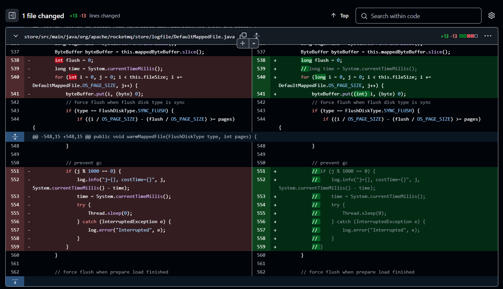

> 冰冻三尺，非一日之寒。
> -- 王充《论衡》--《状留篇》

> 通往罗马的路不止一条（ALL ROADS LEAD TO ROME）
> -- 伊尔莎·斯奇培尔莉

> 但我为什么指望我能影响自己的女儿呢？
> -- 朱迪斯·里奇·哈里斯《教养的迷思》

> 世界的意义存在于世界之外。
> 世界是独立于我的意志的。
> 幸运者的世界与不幸者的世界是不同的。
> -- 路德维希·约瑟夫·约翰·维特根斯坦《逻辑哲学论》

> 未经反思自省的人生没有意义。
> 纵使富有的人以其财富自傲，但在他还不知道如何使用他的财富以前，别去夸赞他。
> -- 苏格拉底

> 没有反省的人生不值得活。
> 人是寻求意义的动物。
> 不知道自己的无知，乃是双倍的无知。
> 智者说话，因为有话要说；愚者说话，因为要说些话。
> -- 柏拉图

> 整体大于部分之和。
> 与战胜敌人的人相比，战胜欲望的人更加勇敢.
> 他们活着，为了吃饭；而我吃饭，为了活着。
> -- 亚里士多德

> 每一个不曾起舞的日子,都是对生命的辜负。
> 自由的保证是什么？是对自己不再感到羞耻。
> 人们杀死了上帝，却又崇拜一个个偶像。
> 一棵树要长得更高，接受更多的光明，那么它的根就必须更深入黑暗——深入恶中。
> -- 弗里德里希·威廉·尼采

> 我们必须设想西西弗斯是幸福的。 -- 阿尔贝·加缪

> 鱼与熊掌不可得兼。 -- 孟子

> 实践是检验真理的唯一标准。 -- 邓小平

> 活着这个词在中国的语境里充满了力量，它的力量不是来自于呐喊，也不是来自于反抗,而是要忍受，去忍受现实中的苦难和平庸,去忍受生命中本不该有的不公与不义。在这样的世界里，有一种心眼坏了，叫知足常乐;有一种眼睛瞎了，叫岁月静好;有一种耳朵聋了，叫与世无争。中国是这三种人的天堂。 -- 余华
>
> > 万种不堪无所谓，苟活世间品百味。

> 最忌讳：
>
> - 贪图享乐，又好吃懒做。
> - 无财无能，又贪财好色。
> - 眼高手低，又怨天尤人。
> - 无勇无谋，又勤于谋策。
>
> 间歇性踌躇满志，持续性混吃等死

> 简单问题复杂化，复杂问题虚无化，是大部分人解决问题的办法。

> 我站在巨人的肩膀上，我爬上同伴们的尸体，我才来到这样的一个高度，我必须有我的担当。

> 不要努力，努力毫无意义，努力唯一的作用就是自我感动。不要加油。要保持健康的节奏，遵循事物发展的规律，然后执行而不是努力。

> 劳动人民的双手创造真正的价值，而不是抽象的简历、IT 黑话、符号、股票。

> 技能，语言，实践，眼光。

# 为什么说 IT 行业的“技术”是垃圾？

## 摘要

本文讲解就业问题，特别是互联网行业的“技术”相关问题。

本文没有参考文献，因为我的思想是否为先人所发现过并不重要。

**关键词**：就业 互联网 IT 编程 技术 资本

## 一、背景

目前，IT 行业蓬勃发展，各种技术层出不穷。特别是在人工智能领域，热点研究就是大语言模型。

在全世界都在大力发展 AI 时，中国互联网行业却呈现出不一样的姿态。
根据 Jetbrains 的调查，中国有 50%以上的程序员是 java 程序员。
这与电商时期中国互联网行业的飞速发展有关。
以阿里巴巴、字节跳动、腾讯、美团等为首的互联网头部企业，
垄断了 IT 技术能够垄断的一切服务业
——财务、娱乐、游戏、衣食住行等。

由于中国的网络长城防火墙保护主义，
国外的垄断企业（Youtube、telegram、X、Google 等）
不会压制到国内企业发展。
因此，国内互联网行业别有一番风景。

在 2023 年互联网“寒冬”时期后，已经成体系的 Java 培训、Java 就业、Java 升职系统彻底崩盘。
此前十年间，大部分本科学生只要会一点点 408 和后端知识，就可以轻松拿到大厂 offer，斩获几十万年薪。
但在疫情的影响下，泡沫经济时代的代表行业——互联网行业，开始呈现颓势。

为什么，会变成这样呢？

## 二、问题提出

### 2.1. “技术”到底是什么？为什么有技术？为什么说技术都是垃圾？如何学到真技术？

### 2.2. 资本主义垄断企业的本质是什么？为什么要反对资本主义？如何杀死资本主义？

### 2.3. 就业问题的根源是什么？如何解决？

## 三、问题解答

### 3.1. 技术

#### 3.1.1. 技术源自需求——先有需求，才有技术

#### 3.1.2. 技术为什么流行？

#### 3.1.3. 技术为什么容易上手？

#### 3.1.4. 技术为什么垃圾？

#### 3.1.5. 什么是真正的技术？

### 3.2. 企业与资本

#### 3.2.1. 企业的根本属性——资本性

#### 3.2.2. 垄断的恶果

#### 3.2.3. 技术越强，越找不到工作

### 3.3. 就业

#### 3.3.1. 落后的思想——愚昧的大学生

#### 3.3.2. 就业的本质——资本的调控

### 3.4. 睁眼看世界

### 3.5. 我们的局限性

## 扩展延伸阅读

- https://m.huxiu.com/article/3334240.html
  > 对话 RWKV 作者[彭博]：单枪匹马挑战 Transformer 的神秘怪才
- https://m.huxiu.com/article/3827317.html
  > 软件行业有很多“潜规则”，行外人不知道，行内人不能说。因为说出来会被视为“行业叛徒”——比如我
- https://bbs.kanxue.com/thread-282784.htm
  > （网吧传奇霸业的计算机安全攻防技术与利益）无硬盘、网络拦截、进\线程、（有/无）模块注入、文件、注册表、窗口拦截、驱动注入、浏览器抢占、登陆器封禁、替换软件渠道号、hook 与 unhook、拦截与反拦截、注入与反注入。
- https://cloud.tencent.com/developer/article/2148368
  > 没有二十年功力，写不出这一行“看似无用”的代码！
  >
  >     Thread.sleep(0);
  >
  > ```java
  > // src: org.apache.rocketmq.store.logfile.DefaultMappedFile#warmMappedFile
  >
  > for (int i = 0, j = 0; i < this.fileSize; i += DefaultMappedFile.0S_PAGE_SIZE, j++) {
  >     // ... 业务代码 ...
  >     // prevent gc
  >     if (j % 1000 == 0) {
  >         try {
  >             Thread.sleep(0);
  >         } catch (InterruptedException e) {}
  >     }
  > }
  > ```
  >
  > - https://github.com/apache/rocketmq/blob/develop/store/src/main/java/org/apache/rocketmq/store/logfile/DefaultMappedFile.java
  > - https://github.com/apache/rocketmq/pull/4903
  > - https://github.com/apache/rocketmq/commit/613d483a18bddcea26783d1e80752360821afce9
  >
  > 
